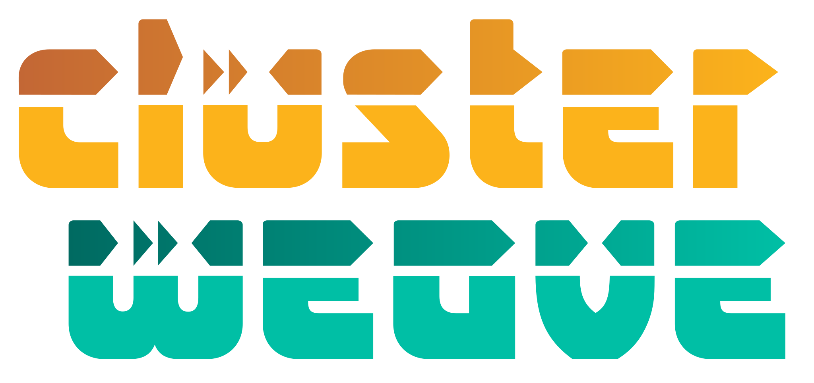
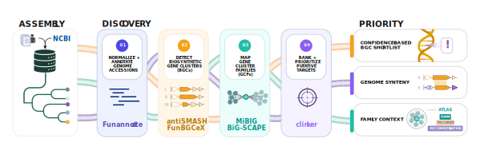

<p align="center">
  
</p>

<p align="center">
  
</p>

# An accessible workbench for fungal biosynthetic discovery

ClusterWeave connects genome preparation, annotation, antiSMASH, FunBGCeX, BiG-SCAPE, summary tables, clinker synteny panels, and figures into one reproducible run.

The repository contains the reusable workflow, web UI/API, worker orchestration, build recipes, tests, public-safe examples, and release documentation. It does not retain draft publication text or private runtime data.

## Manuscript
- Title: ClusterWeave: a workflow for biosynthetic target discovery and prioritization
- Authors: Julian B. Cosner, Stanton Martin, and Tomás A. Rush
- Keywords: genome mining, biosynthetic gene clusters, gene cluster families, natural products, workflow automation
- DOI: pending

## Submit A Web Job

Starting a [new job](clusterweave.org) is easy. In the web UI:

1. Open `INPUT STATION`.
2. Enter a required project name.
3. Optionally enter an email address for result links.
4. Add NCBI assembly accessions manually, paste a one-accession-per-line list, upload a `.txt` accession list, or upload supported genome files.
5. Optionally choose a target genome and ecology labels.
6. Submit the run.

Supported public inputs:

- NCBI assembly accessions
- `.txt` accession list, one accession per line
- `.fasta`, `.fa`, `.fna`, `.fsa`, `.gb`, `.gbk`, `.gbff`

Use public or releasable data only on a public service. Sensitive data should be run locally or on approved internal infrastructure.

## Track And Load Runs

After submission, ClusterWeave shows:

- project name
- ClusterWeave job ID
- result access code
- private result link
- expiration date
- current workflow state

The run stack lets one browser tab switch between submitted or loaded jobs. `ADD RUN` returns to the input station without discarding the existing run stack.

To reopen a job later, use `NEW RUN / EXISTING RESULTS` and paste either:

- a full private result link, or
- the job ID plus result access code

## View And Download Results

When a job completes, open `RESULT BLOCKS`.

Tabs:

- `ANTISMASH`: per-genome antiSMASH views
- `FUNBGCEX`: FunBGCeX output rows
- `BIG-SCAPE`: BiG-SCAPE web viewer and database download
- `CLINKER`: synteny panels
- `SUMMARY`: markdown and table summaries
- `FIGURES`: rendered SVG/PNG figures

Use the top-strip `Download package` button to download the full result package. Individual output rows also provide `Open` and `Download` actions when those artifacts exist.

## Web Portal FAQ

### What if my genome file is larger than the public upload limit?

The hosted portal has public-use limits so shared compute stays responsive. If your genome file is larger than the portal limit, or if the data is sensitive/private, use the local GitHub workflow instead of uploading it to the public service.

The web UI shows the current public limits before file selection. Typical launch limits are `500 MB` per file and `1 GB` total per run, but the live portal may change those values.

### When should I use the local workflow instead of the hosted portal?

Use the local workflow for large datasets, private genomes, custom runtime settings, heavy reruns, or analyses that need institutional compute resources. Start with the command-line workflow below.

## Command-Line Workflow

Normal users should use the hosted web portal mentioned above. Advanced users can clone the repository and run the same canonical workflow locally on Linux or WSL.

### Scope

The canonical workflow stages are:

- Stage 1: annotation plus antiSMASH and FunBGCeX via `run_annotation_and_detection.sh`
- Stage 2: BiG-SCAPE family inference via `run_bigscape.sh`
- Stage 3: summary-table generation via `summarize_clusterweave.sh`
- Optional within Stage 3: ecology-aware ranking with `RUN_ECOLOGY_ANALYSIS=1`
- Stage 4: dataset-wide clinker family-atlas staging and execution via `run_clinker.sh`
- Optional: NPLinker exploratory paired-omics follow-up via `run_nplinker.sh`

### Default Local Layout

ClusterWeave assumes the repository root is the project root:

```text
data/genomes/fungi/<project-name>/
data/results/<project-name>/
software/
```

The default generated layout is lowercase. If an older local checkout used `Data/` or `Software/`, move those directories to `data/` and `software/` or set `DATA_ROOT`, `RESULTS_ROOT`, and `SOFTWARE_ROOT` explicitly for that legacy run.

### CLI Quick Start

Start with an accession list. The default file is [accessions.txt](accessions.txt), but project-specific accession files are recommended.

```bash
bash install_ncbi_cli.sh
PROJECT_NAME=my_project ACCESSIONS_FILE=$PWD/accessions.txt bash prepare_genomes_from_accessions.sh
PROJECT_NAME=my_project bash run_clusterweave.sh
```

`prepare_genomes_from_accessions.sh` writes:

```text
data/genomes/fungi/<project-name>/accessions_fungusID_taxonomyID.txt
```

The mapping includes accession, normalized genome ID, taxonomy ID, and genome size in Mb when available.

`run_clusterweave.sh` runs annotation/detection, BiG-SCAPE, summary generation, clinker staging, and clinker execution in one pass. The default clinker behavior is a dataset-wide atlas run.

Set `TARGET_GENOME` when you want target-aware summary or synteny outputs:

```bash
TARGET_GENOME=Your_Target_Genome_ID PROJECT_NAME=my_project bash run_clusterweave.sh
```

## Running More Than One Project

`PROJECT_NAME` separates one ClusterWeave run from another.

Each project writes to its own local genome and result roots:

- `data/genomes/fungi/<project-name>/`
- `data/results/<project-name>/`

A separate project usually means a different `PROJECT_NAME`, a different accession list through `ACCESSIONS_FILE`, and optionally a different `TARGET_GENOME`.

```bash
PROJECT_NAME=project_alpha ACCESSIONS_FILE=$PWD/accessions_project_alpha.txt bash prepare_genomes_from_accessions.sh
PROJECT_NAME=project_alpha bash run_clusterweave.sh

PROJECT_NAME=project_beta ACCESSIONS_FILE=$PWD/accessions_project_beta.txt bash prepare_genomes_from_accessions.sh
PROJECT_NAME=project_beta bash run_clusterweave.sh
```

## Optional Configuration

You do not need to copy an env file to get started.

- [config/defaults.env](config/defaults.env) is the reference sheet of supported knobs.
- [profiles/example_project.env](profiles/example_project.env) is a generic profile example.
- Use env files or inline variables only when overriding paths, resources, or analysis behavior.

Common examples:

```bash
TARGET_GENOME=Your_Target_Genome_ID bash run_clusterweave.sh
RUN_ECOLOGY_ANALYSIS=1 TARGET_GENOME=Your_Target_Genome_ID bash summarize_clusterweave.sh
CLINKER_MODE=targeted TARGET_GENOME=Your_Target_Genome_ID bash run_clinker.sh
```

## Common Follow-Ups

Regenerate summary tables without rerunning earlier stages:

```bash
bash summarize_clusterweave.sh
```

Enable ecology-aware prioritization and shortlist outputs:

```bash
RUN_ECOLOGY_ANALYSIS=1 TARGET_GENOME=Your_Target_Genome_ID bash summarize_clusterweave.sh
```

If ecology metadata has not been normalized yet, the summary stage scaffolds `summary_tables/ecofun_metadata_normalized.tsv` from the accession mapping. Genomes without curated labels remain blank until edited.

Focus ecology-aware prioritization around a specific label:

```bash
RUN_ECOLOGY_ANALYSIS=1 TARGET_GENOME=Your_Target_Genome_ID FOCUS_ECOLOGY_LABEL=Your_Ecology_Label bash summarize_clusterweave.sh
```

Stage and execute clinker panels directly:

```bash
bash run_clinker.sh
```

Stage clinker panel inputs and scripts without executing clinker:

```bash
RUN_CLINKER=0 bash run_clinker.sh
```

Choose atlas-only, targeted-only, or both:

```bash
CLINKER_MODE=atlas bash run_clinker.sh
CLINKER_MODE=targeted TARGET_GENOME=Your_Target_Genome_ID bash run_clinker.sh
CLINKER_MODE=both TARGET_GENOME=Your_Target_Genome_ID bash run_clinker.sh
```

## Figures And Network Exports

Render final figures and graph-ready exports from generated tables:

```bash
bash run_figures.sh
```

When BiG-SCAPE outputs are present, the figure stage writes:

- `data/results/<project-name>/figures/big_scape_multipanel.svg`
- `data/results/<project-name>/figures/big_scape_multipanel.png`
- `data/results/<project-name>/figures/bgc_overlap.svg`
- `data/results/<project-name>/figures/bgc_overlap.png`
- `data/results/<project-name>/figures/bigscape_network.graphml`
- `data/results/<project-name>/figures/bigscape_network_node_attributes.tsv`
- `data/results/<project-name>/figures/bigscape_network_edge_attributes.tsv`

The network renderer uses numbered fungal/sample IDs, BGC-class node fill, ecology-colored borders when informative metadata exists, a blue outer ring for MiBIG reference GBKs, and a small blue dot for representative dataset records with MiBIG-style BGC accession hits.

Run the network renderer directly:

```bash
python bin/render_bigscape_network.py \
  --project-root . \
  --project-name your_project \
  --metadata your_ecology_metadata.tsv \
  --ecology-field ecology_category \
  --formats svg,graphml,png
```

Useful figure controls:

```bash
RUN_BIGSCAPE_NETWORK_FIGURE=0 bash run_figures.sh
RUN_BGC_OVERLAP_FIGURE=0 bash run_figures.sh
FORCE=1 bash run_figures.sh
BIGSCAPE_NETWORK_MAX_NODES=250 bash run_figures.sh
BIGSCAPE_NETWORK_INCLUDE_MIBIG_ONLY=1 bash run_figures.sh
```

PNG/PDF export uses `cairosvg` when installed. SVG and GraphML do not require extra plotting packages.

The summary bar-chart layer uses condensed BGC categories:

- `NRP`
- `PKS`
- `RiPP`
- `Terpene`
- `Hybrid`
- `Other`

Isolated labels such as `indole`, `alkaloid`, `saccharide`, `ICS`, and other non-core categories are grouped into `Other`. Terpene cyclases and terpene synthases are grouped under `Terpene`.

## Ecology Metadata

Ecology is optional. The main BGC outputs do not require it.

- User-facing ecology TSV: `data/results/<project-name>/summary_tables/ecofun_metadata_normalized.tsv`
- Static header template: [config/metadata_template.tsv](config/metadata_template.tsv)
- Project-local editable scaffold: `data/results/<project-name>/summary_tables/ecofun_metadata_template.tsv`

Important columns:

- `accession`
- `genome_id_current`
- `taxonomy_id`
- `genome_size_mb`
- `genome_id_original_if_different`
- `ecofun_primary`
- `ecofun_secondary`

Leave ecology blank for core BGC summaries. Set `RUN_ECOLOGY_ANALYSIS=1` only when you want ecology-aware grouping and ranking.

## Skipping Or Rerunning Stages

The default behavior is beginner-friendly: if a required container or resource is missing, ClusterWeave tries to pull or build it automatically.

Stage 1 can:

- pull the official antiSMASH image if `ANTISMASH_SIF` is missing
- build a repo-local FunBGCeX SIF in `software/funbgcex/` if `FUNBGCEX_SIF` is missing
- use a repo-local funannotate runtime from `software/funannotate/`

Disable stages from the wrapper instead of editing scripts:

```bash
RUN_STAGE_BIGSCAPE=0 bash run_clusterweave.sh
RUN_STAGE_SUMMARY=0 bash run_clusterweave.sh
RUN_STAGE_ANNOTATION=0 RUN_STAGE_BIGSCAPE=1 RUN_STAGE_SUMMARY=1 bash run_clusterweave.sh
RUN_STAGE_CLINKER=0 bash run_clusterweave.sh
RUN_CLINKER=0 bash run_clusterweave.sh
```

For stricter offline or reproducibility-focused runs, prepopulate runtime artifacts and disable auto-fetch behavior in your environment:

```bash
AUTO_PULL_IMAGES=never
AUTO_BUILD_FUNBGCEX_SIF=0
AUTO_PULL_BIGSCAPE_SIF=0
AUTO_DOWNLOAD_PFAM=0
AUTO_DOWNLOAD_FASTTREE=0
MIBIG_AUTO_DOWNLOAD=0
AUTO_PULL_NPLINKER_SIF=0
NPLINKER_BOOTSTRAP_ENV=0
```

## Container Images

GitHub Actions can publish web and worker images to GitHub Container Registry from version tags and GitHub releases.

Published image names:

- `ghcr.io/n2mology/clusterweave-web`
- `ghcr.io/n2mology/clusterweave-worker`

Build roles:

- `Dockerfile.web` builds the lightweight web/API service.
- `Dockerfile.worker` builds the worker with canonical ClusterWeave shell entrypoints and helper scripts under `/clusterweave`.

Release example:

```bash
git tag v0.3.1-beta
git push origin v0.3.1-beta
```

After the tag publish workflow finishes, pull pinned images:

```bash
docker pull ghcr.io/n2mology/clusterweave-web:v0.3.1-beta
docker pull ghcr.io/n2mology/clusterweave-worker:v0.3.1-beta
```

Run pinned compose images:

```bash
CLUSTERWEAVE_IMAGE_TAG=v0.3.1-beta docker compose -f clusterweave.yml pull
CLUSTERWEAVE_IMAGE_TAG=v0.3.1-beta docker compose -f clusterweave.yml up -d
```

Replace `v0.3.1-beta` with the release tag you want to deploy.

For local advanced deployments, review [docs/WEB_RUNTIME.md](docs/WEB_RUNTIME.md) before exposing a service beyond localhost.

## Repository Layout

- `bin/`: Python helpers used by shell stages
- `scripts/ncbi/`: NCBI download, rename, and flatten helpers
- `config/`: default templates and metadata schema
- `profiles/`: example runtime profiles
- `docs/`: install, runtime, release, and reproducibility notes
- `examples/`: public-safe example outputs
- `visuals/`: public logo and workflow image assets
- `tests/`: software regression tests
- `data/`: ignored local runtime data root
- `software/`: local tool/cache root with selected build recipes tracked
- `web/`: web UI, API, worker, notifications, and runtime helpers

## Examples Vs Tests

- `examples/example_project/` is for public-safe walkthrough material and small example-output bundles.
- `tests/` is for automated software validation and regression checks. It is not intended to represent a biological analysis project.

## Public Repository Hygiene

Tracked source should stay free of:

- `.env` files and secrets
- private job data, raw logs, and full result archives
- downloaded databases and container/SIF artifacts
- local work directories and caches
- draft publication text or editable design sources

Public-safe visuals retained in this repo:

- [visuals/logo.svg](visuals/logo.svg)
- [visuals/logo_black.svg](visuals/logo_black.svg)
- [visuals/ClusterWeave.svg](visuals/ClusterWeave.svg)

## Validation

Common checks:

```bash
python3 -m unittest discover -s tests -p "test_*.py"
bash -n run_clusterweave.sh
bash -n run_annotation_and_detection.sh
bash -n run_bigscape.sh
bash -n summarize_clusterweave.sh
bash -n run_clinker.sh
git diff --check
```

Web source checks:

```bash
node --check web/static/assets/clusterweave.js
node --input-type=module --check < web/static/assets/workflow-dna-progress.js
python3 -m unittest tests.test_repo_layout tests.test_web_api_auth
```

## Release And Citation Files

- [LICENSE](LICENSE)
- [CITATION.cff](CITATION.cff)
- [THIRD_PARTY.md](THIRD_PARTY.md)
- [DATA_SOURCES.md](DATA_SOURCES.md)
- [docs/RELEASE_CHECKLIST.md](docs/RELEASE_CHECKLIST.md)
- [docs/REPRODUCIBILITY.md](docs/REPRODUCIBILITY.md)
- [docs/WEB_RUNTIME.md](docs/WEB_RUNTIME.md)
- [web/OPERATOR_AGREEMENT.md](web/OPERATOR_AGREEMENT.md)
- [BEGINNER_SETUP.md](BEGINNER_SETUP.md)

Software DOI: https://doi.org/10.11578/PMI/dc.20260608.2.

## Funding Acknowledgement

This research was funded by the Genomic System Sciences Program, U.S. Department of Energy, Office of Science, Biological and Environmental Research, as part of the Plant-Microbe Interfaces Scientific Focus Area at Oak Ridge National Laboratory (https://pmiweb.ornl.gov/). Oak Ridge National Laboratory is managed by UT-Battelle, LLC, for the U.S. Department of Energy under contract DE-AC05-00OR22725.
