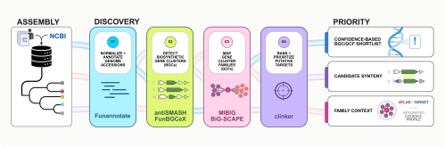

<p align="center">
  
</p>

<p align="center">
  
</p>

# ClusterWeave

ClusterWeave is a genome-mining workbench for studying biosynthetic gene
clusters (BGCs), the neighboring genes that may contribute to a natural-product
pathway. It prepares fungal and bacterial genomes, runs the applicable
annotation and BGC callers, groups related BGCs into gene cluster families
(GCFs), and produces tables, synteny views, and taxon-aware figures that can be
reviewed together.

The workflow accepts fungal, bacterial, or mixed datasets. NCBI taxonomy is the
authority for accession inputs, and ClusterWeave records one route for each
genome before the downstream stages begin. Fungal genomes may use existing
protein features or funannotate when annotation is needed; bacterial genomes use
feature-free sequence with Prodigal gene finding. antiSMASH and BiG-SCAPE apply
to both domains, while FunBGCeX applies only to fungi.

> Web-hosted access: **Coming soon.** ClusterWeave v1.0.1 is available for
> local use through the Docker interface described below.

Version 1.0.1 is the current public ClusterWeave release.

## What the results can and cannot say

ClusterWeave organizes computational predictions for comparison and
prioritization. A predicted BGC, a GCF assignment, a similarity score, or an
annotation hint is not a confirmed metabolite, pathway function, evolutionary
event, or transfer direction. In particular, a cross-kingdom GCF connection is
useful context for follow-up but is not evidence of horizontal gene transfer by
itself.

The results depend on the submitted assemblies, upstream reference data, tool
versions, and selected settings. Zero predicted BGCs can be a valid result.
Similarly, a missing FunBGCeX value for a bacterium means that the fungal-only
tool was not applicable; it should not be interpreted as a failed bacterial
call. Experimental validation and subject-matter review remain necessary.

## Run a job

Web-hosted access is coming soon. The local interface uses the same basic job
path planned for hosted access. After starting a local instance, open
[http://127.0.0.1:8080](http://127.0.0.1:8080) and follow these steps:

1. In **INPUT STATION**, keep **New run** selected and choose **Fungi**,
   **Bacteria**, or **Both**. The scope describes which domains the run accepts;
   NCBI taxonomy still determines the route for each accession.
2. Add NCBI GenBank/RefSeq assembly accessions one per row, paste or upload a
   one-accession-per-line `.txt` file, or upload supported FASTA or GenBank
   genome files. The interface shows the active accession, file-size, upload,
   and queue limits.
3. Enter a required project name. A target genome and ecology labels are
   optional, and an intial run can leave both unset.
4. Select **Submit run**. ClusterWeave validates the input before it publishes a
   job to the filesystem queue.
5. In **Save your result access**, save the private result link. You may instead
   save the job ID together with its separate result access code. The link and
   code are bearer credentials, so do not publish either one.
6. Select **Open run progress**. **BGC WORKFLOW STATION** shows the current tool,
   overall stage state, and per-genome milestones as the worker reports them.
   **RUN STACK** keeps runs available in the current browser tab, and **ADD RUN**
   returns to the input form without discarding those remembered runs.
7. When outputs become available, **RESULT BLOCKS** provides these tabs:

   - **ANTISMASH** opens per-genome antiSMASH reports and region files.
   - **FUNBGCEX** opens fungal FunBGCeX results when the tool applies.
   - **BIG-SCAPE** opens the sanitized viewer and its public-safe database copy.
   - **CLINKER** separates fungal and bacterial synteny panels where available.
   - **SUMMARY** presents comparison tables and review-oriented summaries.
   - **FIGURES** presents taxon-specific multipanels and taxonomy/BGC/GCF
     context figures.

Select **Download package** when you want to preserve a run for review outside
the browser. The downloaded ZIP is the run's full workbench archive. It contains
the reports and tables shown in the interface, the staged genome GenBank files
used by the downstream analysis, the antiSMASH region GenBank files, and the
canonical FunBGCeX BGC GenBank files when FunBGCeX applies. (`.gbk` is a common
filename extension for a GenBank file.) Individual result rows also provide
**Open** or **Download** when that file is eligible for result access.

The archive also contains
`evidence/clusterweave_evidence_manifest.tsv`. This tab-separated evidence
manifest records each included evidence file's path within the archive,
evidence role, genome ID, taxon group, public NCBI source accession when one is
available, byte count, and SHA-256 checksum. It omits internal job paths,
commands, environment values, tokens, and operator fields.

ClusterWeave builds the ZIP when it publishes the results, calculates its
checksum, and records its filesystem identity in the signed completion index.
Therefore, later requests can stream the same unchanged ZIP without compressing
the result files again. A large archive can still take time to cross the
network, but the server does not rebuild it for each download. Original upload
objects and NCBI download caches, tool databases, private logs, scratch files,
the duplicate FunBGCeX `all_clusters` tree, route internals, and operator state
remain outside the archive.

Because the archive contains genome and BGC sequences, anyone who has the
result link can read sequence-bearing scientific output. Protect the link when
the submitted genomes are not public.

To return later, open **New run / Existing results** and paste either the full
private result link or the job ID plus result access code. The browser keeps the
read token in session storage after reading it from the URL fragment; treat a
saved result link with the same care as the underlying code.

## Local Docker start

The trusted local profile supports Docker Engine with Compose v2 on Linux and
Docker Desktop on Windows/WSL2 or macOS. Give Docker at least 4 CPUs and 16 GiB
of memory, and leave enough disk for container images, approximately 6 GiB of
initial reference databases, temporary work, and retained results. The release
has Linux x86_64 build and smoke evidence. WSL2 and macOS use the same pinned
amd64 images, although host integration and Apple Silicon emulation can affect
performance.

Install Git and Docker, then run these commands in a Bash-compatible terminal:

```bash
git clone https://github.com/n2mology/clusterweave.git
cd clusterweave
./bin/init_local_instance.sh
docker compose build
docker compose up -d
docker compose ps
curl --fail http://127.0.0.1:8080/
```

The initializer creates a private mode-0600 `.env` with local secrets and keeps
an existing `.env` unchanged. The initialized profile gives the worker 4 CPUs
and 16 GiB, and `CLUSTERWEAVE_MAX_CPUS_PER_JOB=4` ensures that a public job
accepted by the local web service cannot request more than the worker's default
`CLUSTERWEAVE_WORKER_CPU_LIMIT=4`.

The browser can open while the worker prepares its runtime. On an initial start,
the worker downloads the antiSMASH and Pfam data, installs the NCBI Datasets
command-line tools, pulls the BiG-SCAPE and clinker images, and builds or reuses
the FunBGCeX image. Follow the real progress rather than assuming the worker is
ready:

```bash
docker compose logs -f worker
```

Press `Ctrl-C` to stop following the logs; that does not stop the containers.
The detailed, platform-specific tutorial is [docs/BEGINNER_SETUP.md](docs/BEGINNER_SETUP.md),
and the technical reference is [docs/INSTALL.md](docs/INSTALL.md).

### Local security boundary

`docker-compose.yml` is for one trusted user on one trusted machine. The worker
mounts `/var/run/docker.sock`, which gives the worker substantial control over
the host Docker daemon. Keep the default `127.0.0.1` binding and do not expose
this profile directly to another network or the public internet.

The socket-free `clusterweave.yml` profile requires a configured external
executor such as Slurm. It is an operator profile, not a drop-in laptop
replacement for `docker-compose.yml`.

Do not run `docker compose down -v` during routine operation or an upgrade. The
`-v` option deletes the named volumes that hold job data and downloaded
reference databases.

## Stop, restart, and inspect the local instance

```bash
docker compose logs --tail=200 web worker
docker compose stop
docker compose start
docker compose ps
```

Stopping containers preserves named volumes. Rebuilding or recreating the
services also preserves the volumes unless a user explicitly removes them.
Back up the job-data volume before an upgrade; the beginner and installation
guides provide the full command and explain the archive/source-update choices.

## Inputs and privacy

Public-mode accession submissions accept up to 50 NCBI assemblies by default.
The local interface also accepts bounded `.fasta`, `.fa`, `.fna`, `.fsa`, `.gb`,
`.gbk`, and `.gbff` uploads; current live limits appear before file selection.
A user-generated ecology table is accepted only through the corresponding UI
path. Generic archives and unrecognized auxiliary files are rejected.

Use only public, releasable, or otherwise authorized data on a shared service.
A local instance keeps the normal web/API access model, but local result links
are still credentials and the Docker host still stores uploads, logs, work
files, results, and private metadata. Backups of the job-data volume therefore
have the same sensitivity as the submitted genomes.

## Public examples

Two curated bundles show the v1.0.0 output contract without publishing raw
genomes or private runtime data:

- [`examples/fungi_only`](examples/fungi_only/) retains the 50-genome fungal
  accession set and fungal-only detector outputs.
- [`examples/mixed`](examples/mixed/) contains 20 bacterial and 20 fungal
  assemblies, both taxon mappings, four canonical SVGs, and compact summaries.

The example accession lists are locked inputs for v1.0.0. Their lists and
derived outputs should not be changed in place; a later correction belongs to a
later version with its own provenance.

## Repository and documentation map

| Path | Purpose |
| --- | --- |
| [`docs/BEGINNER_SETUP.md`](docs/BEGINNER_SETUP.md) | First local installation, first job, backup, update, and troubleshooting tutorial |
| [`docs/INSTALL.md`](docs/INSTALL.md) | Detailed local profile, configuration, platform, and troubleshooting reference |
| [`docs/ARCHITECTURE.md`](docs/ARCHITECTURE.md) | Shipped web, queue, worker, taxonomy, and result boundaries |
| [`docs/WEB_RUNTIME.md`](docs/WEB_RUNTIME.md) | Current runtime, resource admission, result access, and security behavior |
| [`docs/CADES_SLURM_BACKEND.md`](docs/CADES_SLURM_BACKEND.md) | External Slurm executor setup and validation |
| [`docs/REPRODUCIBILITY.md`](docs/REPRODUCIBILITY.md) | Run provenance, pinned artifacts, and figure outputs |
| [`examples/`](examples/) | Public-safe accession inputs and selected derived outputs |
| [`bin/`](bin/) and [`scripts/ncbi/`](scripts/ncbi/) | Focused Python helpers and NCBI preparation scripts |
| [`run_clusterweave.sh`](run_clusterweave.sh) | Canonical shell-first scientific entrypoint |
| [`web/`](web/) | Static browser UI, standard-library API, filesystem job store, and worker |
| [`SECURITY.md`](SECURITY.md) | Vulnerability reporting and deployment boundary |
| [`THIRD_PARTY.md`](THIRD_PARTY.md) | Upstream tools, licenses, citations, and redistribution limits |
| [`docs/DATA_SOURCES.md`](docs/DATA_SOURCES.md) | Input, reference-data, and public-example provenance |
| [`CHANGELOG.md`](CHANGELOG.md) | Version history |
| [`docs/RELEASE_CHECKLIST.md`](docs/RELEASE_CHECKLIST.md) | Release validation procedure |

The canonical scientific stages remain shell-first. `run_clusterweave.sh` calls
the annotation/BGC, BiG-SCAPE, summary, clinker, figure, and optional follow-up
entrypoints, while focused Python helpers transform and render declared outputs.
The web layer stages the same workflow rather than maintaining a second
scientific implementation.

## Manuscript, authorship, and provenance

ClusterWeave began as the reusable software workflow for the companion manuscript
*ClusterWeave organizes genome-mining analyses into Integrated Evidence Profiles*.
The authors named in the public metadata are Julian B. Cosner,
Stanton Martin, and Tomás A. Rush. Keywords: genome mining, biosynthetic gene
clusters, gene cluster families, evidence integration, candidate prioritization.
The repository preserves the reusable source,
build recipes, tests, documentation, and public-safe examples; it does not
publish manuscript drafts or private run evidence.

The project is intended to make the manuscript's computational preparation and
build path inspectable and repeatable. That purpose does not turn predictions
into experimental conclusions, and it does not remove the need to cite the
upstream tools and data resources listed in [THIRD_PARTY.md](THIRD_PARTY.md).

## Funding, citation, and license

This research was funded by the Genomic System Sciences Program, U.S. Department
of Energy, Office of Science, Biological and Environmental Research, as part of
the [Plant-Microbe Interfaces Scientific Focus Area](https://pmiweb.ornl.gov/)
at Oak Ridge National Laboratory. Oak Ridge National Laboratory is managed by
UT-Battelle, LLC, for the U.S. Department of Energy under contract
DE-AC05-00OR22725.

Citation metadata is in [`CITATION.cff`](CITATION.cff). The companion software
record resolves at
[doi:10.11578/PMI/dc.20260608.2](https://doi.org/10.11578/PMI/dc.20260608.2).
Version 1.0.1 is the current public release.

ClusterWeave's own source is available under the
[BSD 3-Clause License](LICENSE). Downloaded tools, containers, databases, and
reference data remain under their upstream terms and are not relicensed by this
repository.
