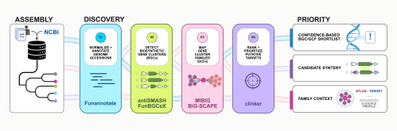

<p align="center">
  
</p>

<p align="center">
  
</p>

# ClusterWeave

A genome-mining workbench for studying biosynthetic gene
clusters (BGCs), the neighboring genes that may contribute to a natural-product
pathway. It prepares fungal and bacterial genomes, runs the applicable protein-coding
annotation and BGC detection tools, groups related BGCs into gene cluster families
(GCFs), and produces tables, synteny views, and taxon-aware figures that can be
reviewed together.

The current source workflow accepts fungal, bacterial, plant, or mixed datasets. NCBI taxonomy is the
authority for accession inputs, and ClusterWeave records one route for each
genome before the downstream stages begin. Fungal genomes may use existing
protein features or funannotate when annotation is needed; bacterial genomes use
feature-free sequence with Prodigal gene finding. antiSMASH and BiG-SCAPE apply
to fungi and bacteria, while FunBGCeX applies only to fungi. Plants require
compatible supplied translated GenBank CDS and use plantiSMASH; they can join
BiG-SCAPE comparisons without implying equivalent biology across taxa.

> Web-hosted access: **Coming soon.** ClusterWeave v1.1.0 is currently
> available only for local use through the Docker interface described below.

Version 1.1.0 is the current public ClusterWeave release.

[Watch the ClusterWeave fungal demo on YouTube](https://youtu.be/pCHNmzbBZ0Y).

## What the results can and cannot say

ClusterWeave organizes computational predictions for comparison and
prioritization. A predicted BGC, a GCF assignment, a similarity score, or an
annotation hint is not a confirmed metabolite, pathway function, evolutionary
event, or transfer direction. In particular, a cross-kingdom GCF connection is
useful context for follow-up but is not evidence of horizontal gene transfer by
itself.

The results depend on the submitted assemblies, upstream reference data, tool
versions, and selected settings. Zero predicted BGCs can be a valid result.
Similarly, a missing FunBGCeX value for a bacterium or plant means that the fungal-only
tool was not applicable; it should not be interpreted as a failed bacterial
report. When an annotation failure is eligible for exclusion, the user must
explicitly choose to continue with the remaining genomes. Check the exclusion notice and methods;
missing annotation or skipped detection does not show BGC absence. Experimental
validation and subject-matter review remain necessary.

## Run a job

The current source checkout runs through the local interface. After starting a local instance,
open [http://127.0.0.1:8080](http://127.0.0.1:8080) and follow these steps:

1. In **INPUT STATION**, keep **New run** selected. **Mixed** is the default;
   choose **Fungi**, **Bacteria**, or **Plants** to restrict the intake. NCBI
   taxonomy determines the accession route but does not validate plant CDS.
   Saved jobs and explicit CLI/API callers retain historical `both` = fungi + bacteria.
2. Add NCBI GenBank/RefSeq assembly accessions one per row, paste or upload a
   one-accession-per-line `.txt` file, or upload supported FASTA or GenBank
   genome files. The interface shows the active accession, file-size, upload,
   and queue limits.
3. Enter a required project name. A target genome and ecology labels are
   optional, and an initial run can leave both unset.
4. Select **Validate**, then **Submit run**. ClusterWeave validates the input
   before it publishes a job to the filesystem queue.
5. In **Save your result access**, save the private result link. You may instead
   save the job ID together with its separate result access code. The link and
   code are bearer credentials, so do not publish either one.
6. Select **Open run progress**. **BGC WORKFLOW STATION** shows the current tool,
   overall stage state, and per-genome milestones as the worker reports them.
   **RUN STACK** keeps runs available in the current browser tab, and **ADD RUN**
   returns to the input form without discarding those remembered runs.
7. When outputs become available, **RESULT BLOCKS** provides these tabs:

   - **ANTISMASH** opens per-genome antiSMASH reports and region files.
   - **FUNBGCEX** opens fungal FunBGCeX results when the tool applies.
   - **PLANTISMASH** opens supplied-CDS plant reports when the tool applies.
   - **BIG-SCAPE** opens the sanitized viewer and its public-safe database copy.
   - **CLINKER** opens applicable selected-family synteny panels.
   - **SUMMARY** presents comparison tables and review-oriented summaries.
   - **FIGURES** presents taxon-specific multipanels and taxonomy/BGC/GCF
     context figures.

Select **Download package** when you want to preserve a run for review outside
the browser. The downloaded ZIP is the run's full workbench archive. It contains
the reports and tables shown in the interface, the staged genome GenBank files
used by the downstream analysis, the antiSMASH region GenBank files, and the
canonical FunBGCeX BGC GenBank files when FunBGCeX applies. Plant outputs include
the plantiSMASH report, exports and record mappings. (`.gbk` is a common
filename extension for a GenBank file.) Individual result rows also provide
**Open** or **Download** when that file is eligible for result access.

The archive also contains
`evidence/clusterweave_evidence_manifest.tsv`. This tab-separated evidence
manifest records each included evidence file's path within the archive,
evidence role, genome ID, taxon group, public NCBI source accession when one is
available, byte count, and SHA-256 checksum. It omits internal job paths,
commands, environment values, tokens, and operator fields.

ClusterWeave builds the ZIP when it publishes the results, calculates its
checksum, and records its filesystem identity in the signed completion index.
Therefore, later requests can stream the same unchanged ZIP without compressing
the result files again. A large archive can still take time to cross the
network, but the server does not rebuild it for each download. Original upload
objects and NCBI download caches, tool databases, private logs, scratch files,
the duplicate FunBGCeX `all_clusters` tree, route internals, and operator state
remain outside the archive.

Because the archive contains genome and BGC sequences, anyone who has the
result link can read sequence-bearing scientific output. Protect the link when
the submitted genomes are not public.

To return later, open **New run / Existing results** and paste either the full
private result link or the job ID plus result access code. The browser keeps the
result access code in session storage after reading it from the URL fragment;
treat a saved result link with the same care as the underlying code.

On an initialized local instance, **Existing results** also lists retained jobs
automatically. The browser pairs with the trusted local instance and keeps a
private session across tabs and browser restarts. No administrator code is
needed for normal local use. Shared services retain their configured credentials
and per-job result access.

New result packages include `METHODS.md`, `run_metadata.json`, `resources.tsv`,
`CITATIONS.bib` and the distribution's `CITATION.cff`. These identify recorded
software versions, input checksums, parameters, cache producer provenance and
processing resources. Missing measurements are explicit. Native CPU accounting
and sampled container/memory observations have different scopes; configured
limits are not reported as consumption. See [reproducibility](docs/REPRODUCIBILITY.md).
Staged GenBank files are grouped under `input_gbks/bacteria/`,
`input_gbks/fungi/`, `input_gbks/plants/` or `input_gbks/unclassified/` in the ZIP. Internal pipeline
paths remain flat. Existing signed ZIPs remain unchanged.

For supplied-CDS plant analysis, use the [pinned source preparation](docs/PLANTISMASH_RUNTIME.md)
and [confined Linux SIF profile](docs/CONFINED_SIF.md). This profile runs native
tools inside the worker without granting application jobs Docker daemon access.
Nested SIF execution on Windows/WSL2 and macOS has not been measured; Linux
execution does not establish those platform results.

## Local Docker start

The trusted local profile supports Docker Engine with Compose v2 on Linux and
Docker Desktop on Windows/WSL2 or macOS. Use a host with at least 4 usable CPUs and 20 GiB
of RAM; allocate at least 4 CPUs and 18 GiB to Docker (16 GiB for the worker plus 2 GiB for web), and leave enough disk for container images, approximately 6 GiB of
initial reference databases, temporary work, and retained results. The release
has Linux x86_64 build and smoke evidence. WSL2 and macOS use the same pinned
amd64 images, although host integration and Apple Silicon emulation can affect
performance.

Install Git, Docker and [Python 3.9 or newer](https://www.python.org/downloads/)
on the host, then run these commands in a Bash-compatible terminal:

```bash
git clone https://github.com/n2mology/clusterweave.git
cd clusterweave
./bin/init_local_instance.sh --defaults
```

This recommended route accepts Conservative resource limits, enables the bounded
cache, keeps jobs until manual deletion, enables service startup after Docker
starts, and opens the configured browser URL. It builds images, prepares/checks
runtimes, and starts the pipeline without questions. The first run may take a
while; keep the terminal open. Repeating it preserves an existing configuration.

For interactive customization, use:

```bash
./bin/init_local_instance.sh
```

The assistant scans CPU/RAM capacity and offers **Conservative**, **Maximum
available** and **Customize**. Both recommendations reserve room for the host and
web service; capacity is not measured scientific performance. Review and save,
then confirm **READY TO WEAVE?** to begin the build. The CLI shows the build first
and offers the browser initialization screen as soon as web responds, before
runtime downloads. Progress continues in the terminal. Configuration stays in
the CLI; the admin drawer's **Local setup** tab is a read-only reference.

The assistant creates a private mode-0600 `.env` with local secrets and keeps
an existing `.env` unchanged unless you request reconfiguration.
Custom prompts show current limits and suggested values. The job CPU limit stays
at or below the worker budget. Run `./bin/local_instance.sh scan` to check again;
`scan --json` prints the same observations for scripts. Capacity checks do not
establish scientific suitability or measured performance.

Both fresh recommendations enable a separate worker-only accession cache:
10 GiB, 256 entries and 30 days since population. Compatible public accession
results can be reused; eviction causes normal recomputation. Uploaded/private
inputs remain excluded. Existing configurations keep their cache choice until
reviewed reconfiguration. See [cache storage and identity](docs/ACCESSION_CACHE.md).

Fresh local setups keep jobs until you delete them. Hosted jobs expire after
30 days by default; cache retention is independent. Use
`./bin/init_local_instance.sh --reconfigure` to review changes. Automatic startup
after Docker starts and browser opening on later launcher starts are separate
choices, enabled by `--defaults` and prompted during interactive setup. The first-run browser progress choice is independent. Return after shutdown with `./bin/local_instance.sh start`, then
`./bin/local_instance.sh open`; disable with
`./bin/local_instance.sh disable-autostart`. No host startup hooks are installed.
If you save settings and pause before preparation, resume with
`./bin/local_instance.sh weave`. Scripted initialization uses
`./bin/init_local_instance.sh --non-interactive --recommendation conservative`;
add `--weave` only when you intend to build and download runtimes.
The [beginner guide](docs/BEGINNER_SETUP.md) covers readiness and platform limits.

New configurations select `CLUSTERWEAVE_ACCESS_PROFILE=local-owner` and bind
only to `127.0.0.1`. Open the exact printed URL. The local-owner profile trusts
users who can access that local service; it is not a multi-user account system.
For an existing loopback-only installation, add that setting to `.env` and
recreate the web service. The generic Compose default remains `hosted`, which
does not automatically grant browser access. Never expose the local-owner
profile through a public proxy or network binding.

### Change local web job input limits

New `.env` files contain `CLUSTERWEAVE_MAX_ACCESSIONS=50` and
`CLUSTERWEAVE_MAX_GENOME_FILES=50`. These positive integers control the maximum
NCBI assembly accessions and uploaded genome files accepted by one web job.

For a first start, edit `.env` at the repository root after running the
initializer and before starting services. For example:

```dotenv
CLUSTERWEAVE_MAX_ACCESSIONS=75
CLUSTERWEAVE_MAX_GENOME_FILES=75
```

Use only positive integers. `0` is invalid and does not select an uncapped
mode. Existing `.env` files remain unchanged until the local operator edits
them.

From the repository root, inspect the resolved Compose configuration:

```bash
docker compose config --quiet
docker compose config | grep -E 'CLUSTERWEAVE_MAX_ACCESSIONS|CLUSTERWEAVE_MAX_GENOME_FILES'
```

The first command succeeds without an error, and the second prints both values
under the web service. This confirms what Compose will pass to ClusterWeave.

If the local instance is already running, edit `.env`, then recreate only the
web service and inspect its public status from the repository root:

```bash
docker compose up -d --no-deps web
curl --fail http://127.0.0.1:8080/api/system/status
```

A successful update reports the selected values in `public_quota`, and the
browser shows the same accession and genome-file limits. Next, open the local
web interface and prepare the intended inputs.

Increasing either count can increase processing time, storage use, and figure
complexity. Configurable acceptance is not a performance or scientific-scale
guarantee; the synthetic coverage extends to 75 genomes.

`prepare-runtime` acquires the standard local runtime assets listed here: the
antiSMASH and Pfam data, NCBI Datasets tools, pinned third-party images,
FunBGCeX and BUSCO-baked funannotate images, FastTree, MiBIG, and the shared
NPLinker environment. It records image identities and file checksums in the
private software volume. plantiSMASH requires separate
[plant runtime preparation](docs/PLANTISMASH_RUNTIME.md). `check-runtime` verifies the same state without
pulling, downloading, building, installing, or rewriting its manifest.

The worker still runs the same startup subset for compatibility when services
start, publishes the established bootstrap phases, and reuses every prepared
asset. Follow the real progress rather than assuming the worker is ready:

```bash
docker compose logs -f worker
```

Press `Ctrl-C` to stop following the logs; that does not stop the containers.
The detailed, platform-specific tutorial is [docs/BEGINNER_SETUP.md](docs/BEGINNER_SETUP.md),
and the technical reference is [docs/INSTALL.md](docs/INSTALL.md).

### Local security boundary

`docker-compose.yml` is for one trusted user on one trusted machine. The worker
mounts `/var/run/docker.sock`, which gives the worker substantial control over
the host Docker daemon. Keep the default `127.0.0.1` binding and do not expose
this profile directly to another network or the public internet.

The socket-free `clusterweave.yml` profile requires a configured external
executor such as Slurm. It is an operator profile, not a drop-in laptop
replacement for `docker-compose.yml`.

Do not run `docker compose down -v` during routine operation or an upgrade. The
`-v` option deletes the named volumes that hold job data and downloaded
reference databases.

## Stop, restart, and inspect the local instance

```bash
docker compose logs --tail=200 web worker
docker compose stop
docker compose start
docker compose ps
```

Stopping containers preserves named volumes. Rebuilding or recreating the
services also preserves the volumes unless a user explicitly removes them.
Back up the job-data volume before an upgrade; the beginner and installation
guides provide the full command and explain the archive/source-update choices.

## Inputs and privacy

Public-mode accession submissions accept up to 50 NCBI assemblies by default.
Uploaded genome files also default to 50 per web job. The local interface accepts
bounded `.fasta`, `.fa`, `.fna`, `.fsa`, `.gb`, `.gbk`, and `.gbff` uploads;
the configured live limits appear before file selection.
A user-generated ecology table is accepted only through the corresponding UI
path. Generic archives and unrecognized auxiliary files are rejected.

Use only public, releasable, or otherwise authorized data on a shared service.
A local instance keeps the normal web/API access model, but local result links
are still credentials and the Docker host still stores uploads, logs, work
files, results, and private metadata. Backups of the job-data volume therefore
have the same sensitivity as the submitted genomes.

## Public examples

Two compact, accession-defined bundles show the validated v1.0.2 output
contract without redistributing genomes or private execution records:

- [`examples/flavi19`](examples/flavi19/) contains 19 section *Flavi*
  assemblies, sanitized antiSMASH/FunBGCeX candidate reconciliation, explicit
  analysis states, GCF-completion summaries, four representative panel/family
  figures, and the synteny-resolved aspirochlorine focal-locus figure and data.
- [`examples/saccharopolyspora26`](examples/saccharopolyspora26/) contains the
  exact 26 RefSeq assemblies in the public BGCFlow v0.9.0
  `mq_saccharopolyspora` example, with taxon-aware applicability, complete
  configured GCF-assignment summaries, two panel figures, and the
  synteny-resolved geosmin focal-locus figure and data.

The bundles provide versioned accession manifests, portable retrieval and
component-command templates, and eight standalone public SVGs with local data
dictionaries. Component predictions and family assignments are organized
evidence, not biological ground truth.

## Repository and documentation map

| Path | Purpose |
| --- | --- |
| [`docs/BEGINNER_SETUP.md`](docs/BEGINNER_SETUP.md) | First local installation, first job, backup, update, and troubleshooting tutorial |
| [`docs/INSTALL.md`](docs/INSTALL.md) | Detailed local profile, configuration, platform, and troubleshooting reference |
| [`docs/ARCHITECTURE.md`](docs/ARCHITECTURE.md) | Shipped web, queue, worker, taxonomy, and result boundaries |
| [`docs/EXTENDING.md`](docs/EXTENDING.md) | Contributor routes for annotators, BGC detection tools, figures and optional analyses |
| [`docs/WEB_RUNTIME.md`](docs/WEB_RUNTIME.md) | Current runtime, resource admission, result access, and security behavior |
| [`docs/CADES_SLURM_BACKEND.md`](docs/CADES_SLURM_BACKEND.md) | External Slurm executor setup and validation |
| [`docs/ACCESSION_CACHE.md`](docs/ACCESSION_CACHE.md) | Optional accession-result reuse, identity, storage limits and operator inspection |
| [`docs/REPRODUCIBILITY.md`](docs/REPRODUCIBILITY.md) | Run provenance, pinned artifacts, and figure outputs |
| [`examples/`](examples/) | Public-safe accession inputs and selected derived outputs |
| [`bin/`](bin/) and [`scripts/ncbi/`](scripts/ncbi/) | Focused Python helpers and NCBI preparation scripts |
| [`run_clusterweave.sh`](run_clusterweave.sh) | Canonical shell-first scientific entrypoint |
| [`web/`](web/) | Static browser UI, standard-library API, filesystem job store, and worker |
| [`SECURITY.md`](SECURITY.md) | Vulnerability reporting and deployment boundary |
| [`THIRD_PARTY.md`](THIRD_PARTY.md) | Upstream tools, licenses, citations, and redistribution limits |
| [`docs/DATA_SOURCES.md`](docs/DATA_SOURCES.md) | Input, reference-data, and public-example provenance |
| [`CHANGELOG.md`](CHANGELOG.md) | Version history |

The canonical scientific stages remain shell-first. `run_clusterweave.sh` calls
the annotation/BGC, BiG-SCAPE, summary and clinker entrypoints. The web pipeline
prepares inputs first, then invokes the wrapper, figures and selected follow-ups,
and packages results. Direct CLI users invoke preparation and follow-up scripts
explicitly. Focused Python helpers transform and render declared outputs; the
[extension guide](docs/EXTENDING.md) connects these modules to their consumers.

## Manuscript, authorship, and conceptualization

ClusterWeave began as the reusable software workflow for the companion manuscript
*ClusterWeave: taxon-aware reconciliation of biosynthetic gene cluster evidence for comparative genome mining*.
The authors and maintainers of the project are Julian B. Cosner,
Stanton Martin, and Tomás A. Rush. Keywords: genome mining, biosynthetic gene
clusters, gene cluster families, evidence integration, candidate prioritization.
The repository preserves the reusable source,
build recipes, tests, documentation, and public-safe examples.

The project is intended to lower the barrier to entry in computational biology and
make the manuscript's computational preparation and build path inspectable and repeatable.
That purpose does not turn predictions into experimental conclusions, and it
does not remove the need to cite the upstream tools and data resources
listed in [THIRD_PARTY.md](THIRD_PARTY.md).

## Funding, citation, and license

This research was funded by the Genomic System Sciences Program, U.S. Department
of Energy, Office of Science, Biological and Environmental Research, as part of
the [Plant-Microbe Interfaces Scientific Focus Area](https://pmiweb.ornl.gov/)
at Oak Ridge National Laboratory. Oak Ridge National Laboratory is managed by
UT-Battelle, LLC, for the U.S. Department of Energy under contract
DE-AC05-00OR22725.

Citation metadata is in [`CITATION.cff`](CITATION.cff). The companion software
record resolves at
[doi:10.11578/PMI/dc.20260608.2](https://doi.org/10.11578/PMI/dc.20260608.2).
Version 1.1.0 is the current public release.

ClusterWeave's own source is available under the
[BSD 3-Clause License](LICENSE). Downloaded tools, containers, databases, and
reference data remain under their upstream terms and are not relicensed by this
repository.
